# Visual Feature Showcase

This document provides visual examples of all major features in TeamSync, organized by user role.

---

## Table of Contents

1. [Owner Features](#owner-features)
2. [Admin Features](#admin-features)
3. [Member Features](#member-features)
4. [Email Notifications](#email-notifications)

---

## Owner Features

### Owner Dashboard

The owner dashboard provides a complete overview of the organization with key metrics, quota usage, and recent activity.

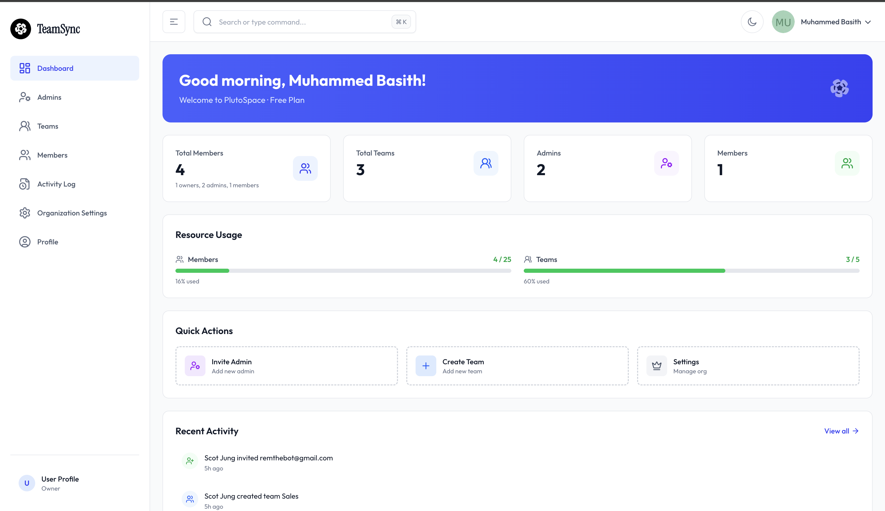

**Features shown:**
- Time-based greeting
- Organization statistics (teams, admins, members)
- Quota usage progress bars
- Recent activity timeline
- Quick action buttons

---

### Managing Admins

Owners can view all admins in the organization and manage their roles.

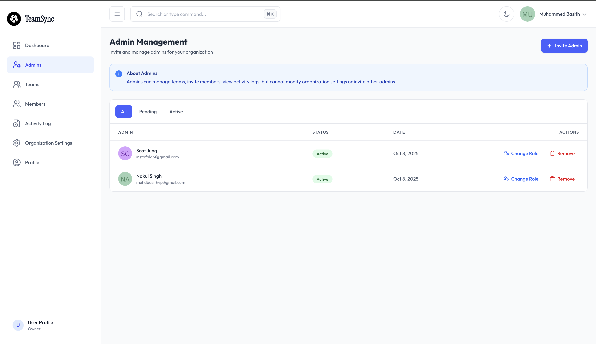

**Features shown:**
- List of all admins
- Teams managed by each admin
- Add admin button
- Remove admin action
- Change role capability

---

### Managing Members

Owners see all members across the entire organization.

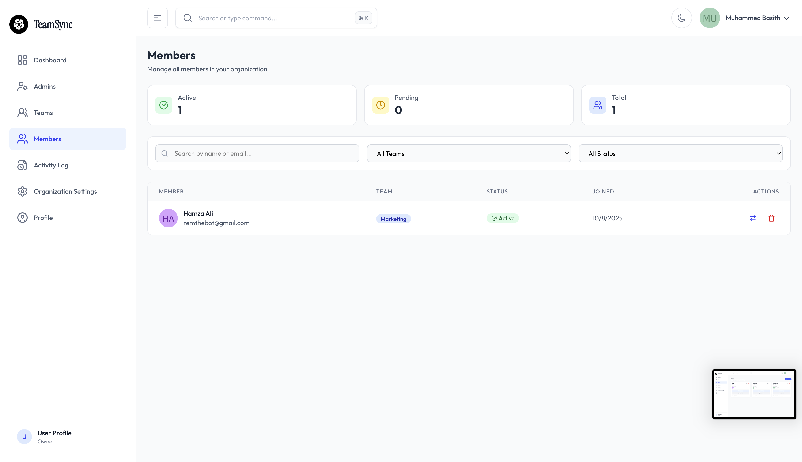

**Features shown:**
- Complete member list
- Member details (name, email, role, team)
- Filter by team
- Change role action
- Remove member action
- Move member between teams

---

### Managing Teams

Owners can view and manage all teams in the organization.

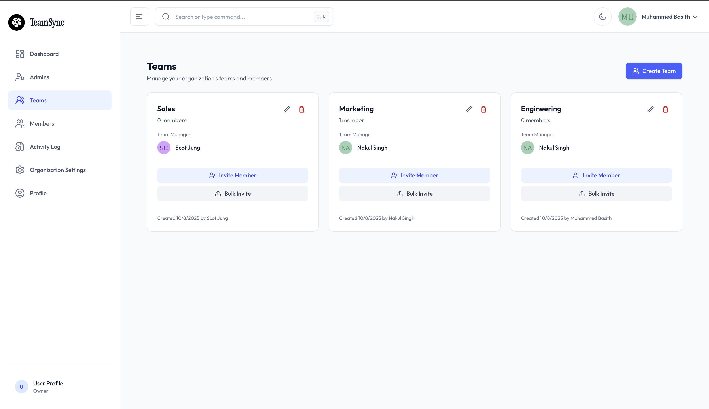

**Features shown:**
- List of all teams
- Team manager information
- Member count per team
- Create new team button
- Team actions (view, edit, delete)

---

### Activity Log

Complete audit trail of all organizational actions with filtering and export capabilities.

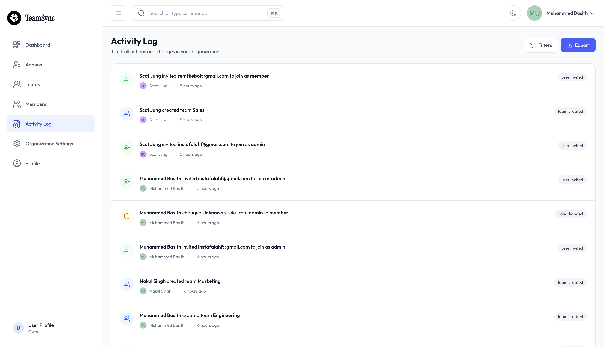

**Features shown:**
- Timeline view of all activities
- Color-coded action types
- Date range filter
- Action type filter
- Export to CSV/JSON
- Pagination for large logs
- Detailed action information

---

### Bulk User Invitation

Owners can upload CSV files to invite multiple users at once.

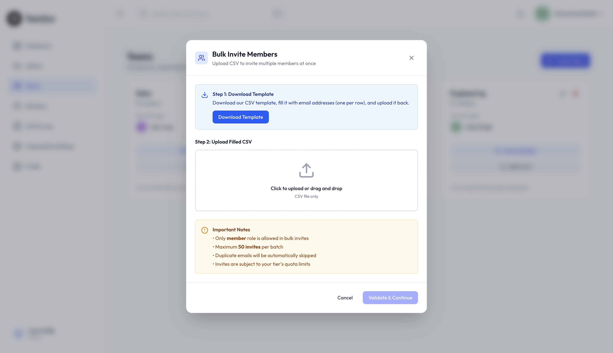

**Features shown:**
- CSV file upload interface
- File format instructions
- Drag and drop support
- Processing status
- Error reporting for invalid entries
- Success summary

---

### Demoting Admin to Member

Owners can change admin roles, with validation for admins managing teams.

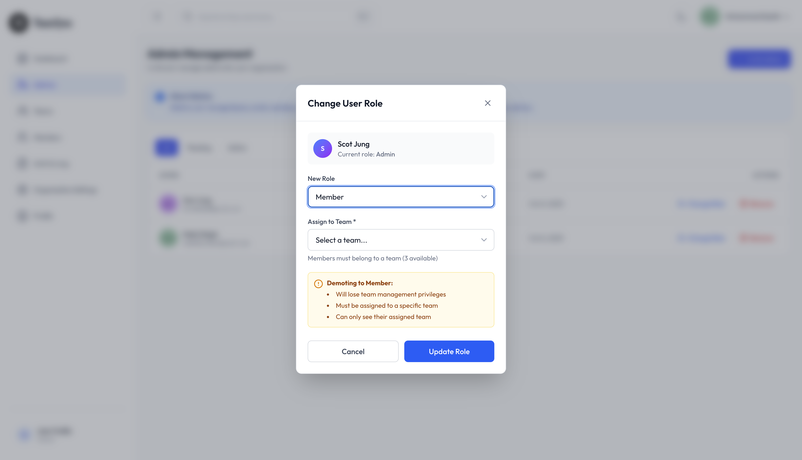

**Features shown:**
- Role change confirmation
- Validation error when admin manages teams
- List of teams blocking demotion
- Clear error messaging

---

### Organization Settings

Owners can customize organization name and color palette.

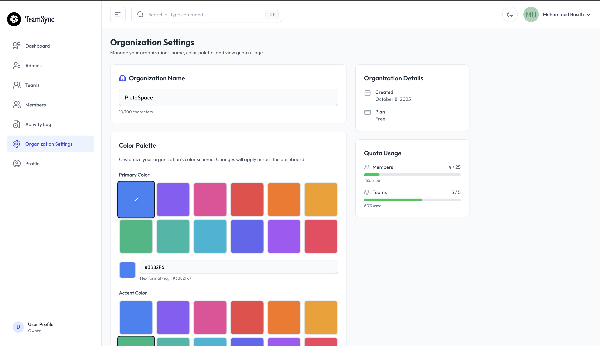

**Features shown:**
- Edit organization name
- Color palette customization (primary, accent, background)
- Color pickers with live preview
- Current tier information
- Save changes button

---

## Admin Features

### Admin Dashboard

Admins see an overview of the teams they manage and organization activity.

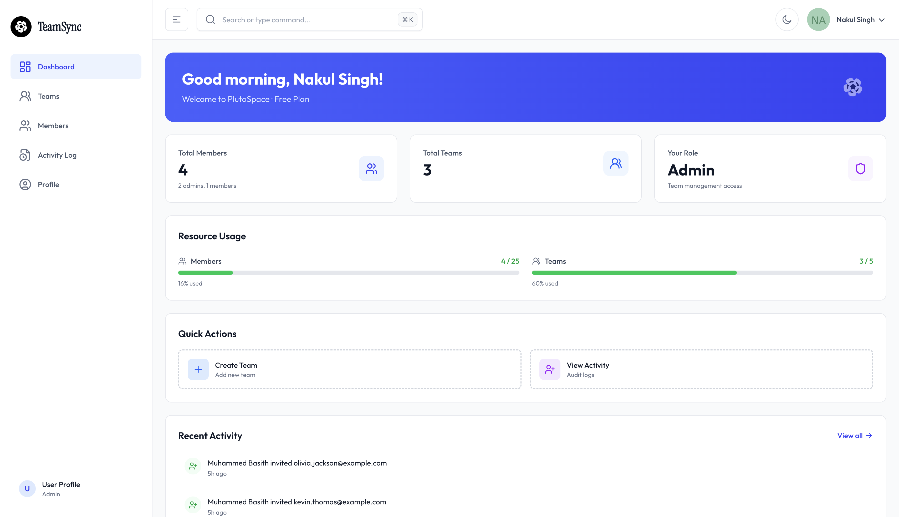

**Features shown:**
- Personalized greeting
- Statistics for managed teams
- Recent activity feed
- Quick actions (create team, invite member)
- Quota information (read-only)

---

### Admin Team View

Admins can view and manage teams they are assigned to manage.

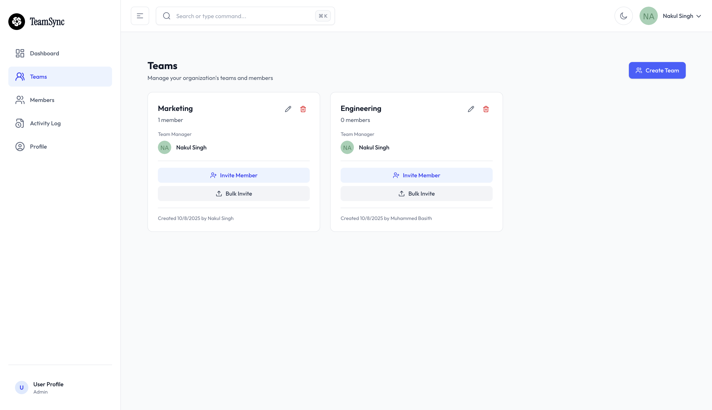

**Features shown:**
- Teams managed by admin
- Team member lists
- Add member to team
- Create new team
- Edit team details

---

### Admin Member Management

Admins can view and manage members in their teams.

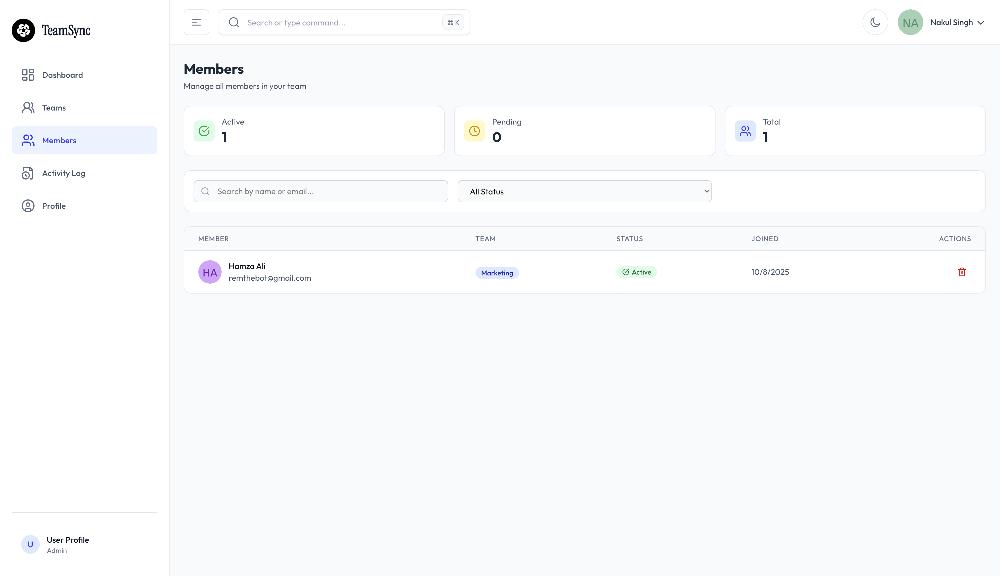

**Features shown:**
- Members in managed teams
- Invite new members
- Remove members from team
- View member details
- Filter by team

---

### Admin Activity Log

Admins have access to the full organization activity log.

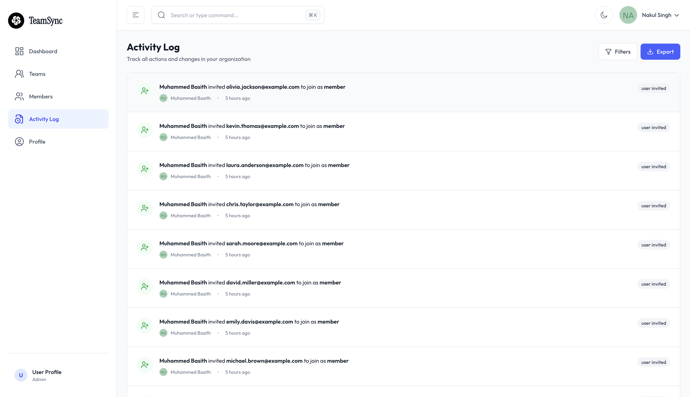

**Features shown:**
- Organization-wide activity timeline
- Filter by date and action type
- Export capabilities
- Pagination
- Detailed action information

---

### Admin Profile

Admins can view and edit their profile information.

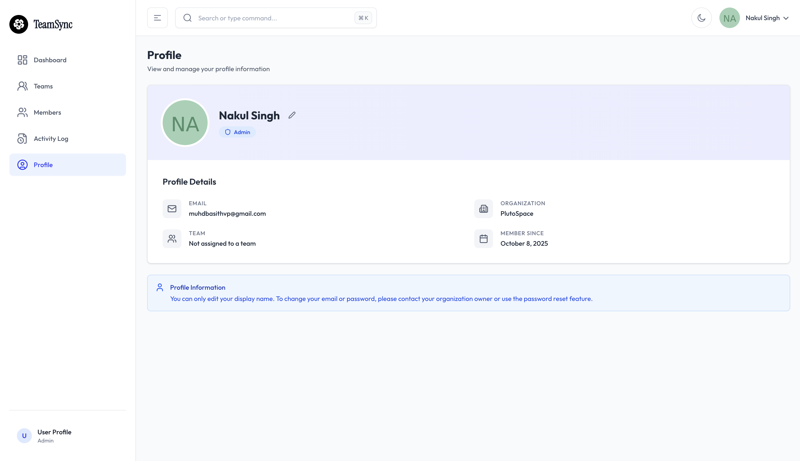

**Features shown:**
- Profile information
- Auto-generated avatar
- Role display
- Organization and team assignment
- Edit profile button

---

### Bulk Invite (Admin)

Admins can also use bulk invitation for members.

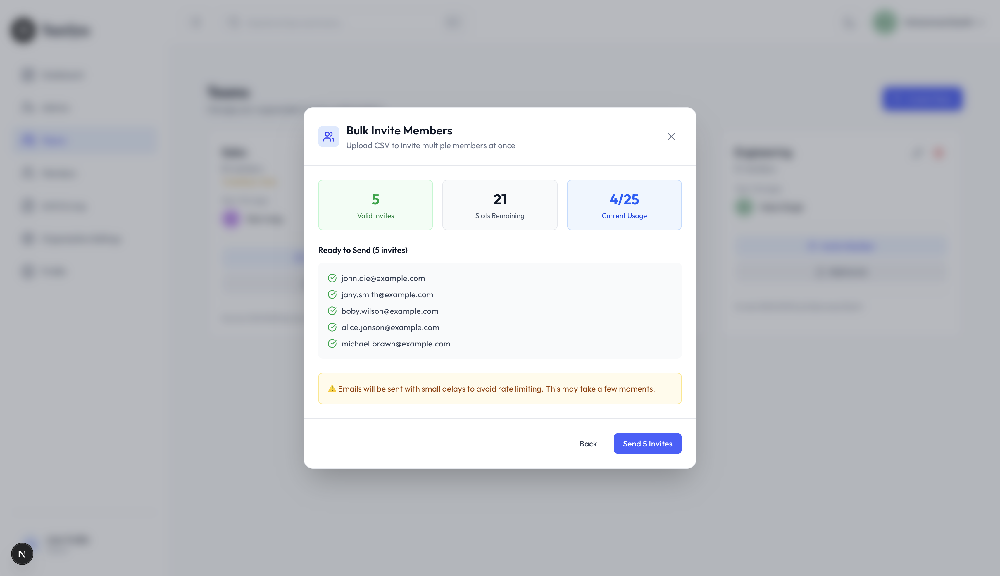

**Features shown:**
- CSV upload interface
- Validation and error handling
- Success/failure reporting
- Member role restriction

---

## Member Features

### Member Dashboard

Members see a simplified dashboard focused on their team.

**Features shown:**
- Welcome message
- Team information
- Team member count
- Limited quick actions
- Profile access

---

### Member Team Display

Members can view their assigned team and team members.

**Features shown:**
- Team name and manager
- List of team members
- Team member roles
- Contact information

---

### Member Profile Section

Members can view and edit their own profile.

**Features shown:**
- Personal information
- Avatar display
- Role and team assignment
- Edit display name
- View-only organization info

---

### Accepting Invite as Member

New members receive invitation emails and can join the organization.

**Features shown:**
- Invitation acceptance page
- Organization information
- Role being assigned
- Team assignment (if applicable)
- Accept/decline buttons
- Invite token validation

---

## Email Notifications

### Role Change Email

When an owner or admin changes a user's role, the user receives an email notification.

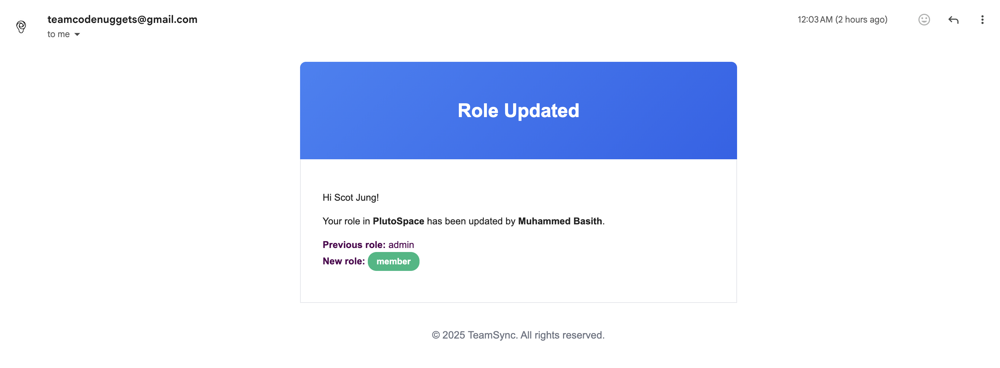

**Features shown:**
- Professional email template
- Clear notification of role change
- Organization branding
- New role information
- Call-to-action button to view dashboard

---

### Account Removed Email

When a user is removed from an organization, they receive a notification email.

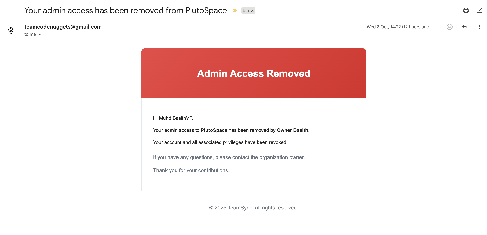

**Features shown:**
- Clear account removal notification
- Professional email design
- Organization information
- Explanation of account status
- Support contact information (if applicable)

---

## Feature Highlights

### Key Functionality Demonstrated

**User Management:**
- Complete invitation workflow (single and bulk)
- Role management with validation
- Member movement between teams
- Admin promotion and demotion

**Team Management:**
- Team creation and assignment
- Manager assignment
- Team member organization
- Team deletion with safeguards

**Activity Logging:**
- Comprehensive audit trail
- Advanced filtering
- Export capabilities (CSV and JSON)
- Timeline visualization

**Access Control:**
- Role-based dashboards
- Permission validation
- Restricted actions based on role
- Clear error messaging

**Resource Management:**
- Quota tracking and display
- Limit validation
- Visual progress indicators
- Upgrade prompts

**Security:**
- Secure authentication
- Session management
- Password reset flow
- Email verification

**Email Notifications:**
- Role change notifications
- Account removal notifications
- Invitation emails
- Professional email templates
- Organization branding in emails

---

## User Flow Examples

### Creating an Organization

1. User signs up with organization name
2. Becomes owner automatically
3. Lands on dashboard
4. Can immediately create teams and invite users

### Inviting and Managing Admins

1. Owner invites admin via email
2. Admin receives invitation email
3. Admin accepts and creates account
4. Admin can create teams and invite members
5. Owner can view admin's managed teams
6. Owner can demote or remove admin (with validation)

### Team and Member Management

1. Owner or admin creates team
2. Admin assigned as team manager
3. Manager invites members to team
4. Members can view their team
5. Manager can move members between teams (if managing multiple)
6. Owner can reassign team manager

### Activity Tracking

1. All actions automatically logged
2. Owners and admins view activity log
3. Filter by date range or action type
4. Export for compliance or reporting
5. Review detailed action information

---

## UI/UX Highlights

**Consistent Design:**
- Clean, modern interface
- Consistent color scheme
- Clear typography
- Intuitive navigation

**Responsive Layout:**
- Works on desktop, tablet, and mobile
- Adaptive sidebar
- Touch-friendly controls
- Responsive tables

**User Feedback:**
- Loading states for async operations
- Success/error messages
- Confirmation dialogs for destructive actions
- Progress indicators

**Accessibility:**
- Semantic HTML
- Keyboard navigation support
- Clear focus indicators
- Descriptive labels and alt text

---

## Summary

These screenshots demonstrate a complete, production-ready team management platform with:
- Intuitive role-based interfaces
- Comprehensive user and team management
- Robust activity logging and auditing
- Clean, modern UI design
- Thoughtful user experience

For detailed feature documentation, see [FEATURES.md](./FEATURES.md).

For setup instructions, see [SETUP.md](./SETUP.md).

For architecture details, see [ARCHITECTURE.md](./ARCHITECTURE.md).

